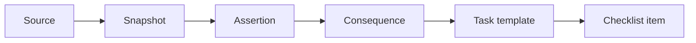

# Clarvia Graph

**Open consequence graph for source-backed administrative workflows**

[](https://github.com/clarvia-org/clarvia-graph/actions/workflows/ci.yml)
[](LICENSE)
[](https://www.bestpractices.dev/projects/13112)
[](LICENSE-DATA)
[](https://doi.org/10.5281/zenodo.20572455)

[](https://clarvia.org/en/checklist)

> **Status:** CI passing · [OpenSSF Best Practices: passing](https://www.bestpractices.dev/projects/13112) · Code: EUPL-1.2 · Data: CC-BY-4.0 · [DOI: 10.5281/zenodo.20572455](https://doi.org/10.5281/zenodo.20572455)

Clarvia Graph is the technical engine behind [Clarvia](https://clarvia.org). It stores all the official rules and steps for bereavement paperwork across Europe — structured so that apps, websites, and public services can use them automatically. For the simple, family-friendly version, see [clarvia.org](https://clarvia.org).

<details>
<summary>📸 Alpha checklist preview</summary>

<br>


> The living demo at [clarvia.org/en/checklist](https://clarvia.org/en/checklist) consumes a static JSON export generated from this graph. See [`exports/example-bereavement-lu.json`](exports/example-bereavement-lu.json) for the exact shape.

</details>

---

Technically, Clarvia Graph is a structured, versioned, source-backed knowledge graph for cross-border administrative consequences. It models what happens after a life event (starting with bereavement), what steps may be required, which authorities are involved, what documents are needed, and where the official source says so.

This repository contains:
- **Schemas** — JSON Schema definitions for all canonical record types
- **Vocabularies** — Controlled vocabularies for jurisdictions, domains, claim types, etc.
- **Graph data** — Source-backed consequences, task templates, conditions, and deadlines
- **Sources** — Official source registry, captured snapshots, and extracted assertions
- **Validation** — CLI tooling to validate, build, and test the graph
- **Exports** — Generated JSON for web consumers ([example](exports/example-bereavement-lu.json)), plus JSON-LD, CPSV-AP, and web runtime bundles

## Repository structure

```
clarvia-graph/
├── schemas/          # JSON Schema definitions (v0.1)
├── vocab/            # Controlled vocabularies
├── graph/            # Consequence graph data (YAML)
│   ├── authorities/
│   ├── conditions/
│   ├── consequences/
│   ├── task_templates/
│   └── …
├── sources/          # Source registry, snapshots, and assertions
├── translations/     # Locale overlay files
├── tests/            # Scenario tests and unit tests
├── exports/          # Generated output (JSON, JSON-LD, web bundles)
├── packages/         # Workspace packages
│   ├── cli/          #   @clarvia/cli — validation, build, and export tooling
│   └── generator/    #   @clarvia/generator — checklist generation engine
├── docs/             # Foundation specification and guides
└── build/            # Build output (git-ignored)
```

The root `package.json` is a [pnpm workspace](https://pnpm.io/workspaces) that orchestrates the packages above. Run `pnpm install` from the root to set up all dependencies.

## Status

🔒 **Foundation specification locked** — The [foundation spec](docs/FOUNDATION.md) defines the complete data architecture, standards alignment, editorial governance, and extensibility model.

🚧 **Early implementation in progress** — Proof-of-concept, alpha, and beta work is proceeding with internal resources to validate the foundation before funded hardening, validation, and scale-up phases.

## Development model

Clarvia Graph is being developed as the technical foundation for source-backed bereavement checklists and related administrative workflows across Europe.

The project is moving through rapid proof-of-concept, alpha, and beta phases. Early versions are built with internal resources so that the data model, graph structure, validation approach, and export pipeline can be tested before larger funding cycles conclude.

This early implementation work is not intended to replace funded development. It is intended to de-risk the technical foundation and demonstrate that the architecture can move from specification to working infrastructure.

Future funded phases will focus on raising the foundation to production quality: schema refinement, validation tooling, source provenance, test coverage, interoperability, documentation, governance, security hardening, maintainability, and support for multiple jurisdictions.

The intended path is to build quickly, learn from real implementation, and then use funded phases to validate, harden, document, and scale the graph responsibly.

## Architecture



Every checklist item traces back to an official source. No legal consequence publishes without an approved source assertion.

## Key design decisions

- **Source-backed**: Every published claim traces to a captured official source
- **Three-valued logic**: Conditions evaluate to `true`, `false`, or `unknown` — never hides uncertainty
- **Cross-border**: Jurisdiction roles (death_place, habitual_residence, work_state, asset_situs) compose layered checklists
- **Static exports**: Consumer apps load generated JSON at build time — no runtime API dependency
- **Privacy-first**: Client-side condition evaluation, no user data sent to servers

## Standards

Clarvia maintains internal Clarvia-native schemas and generates compatibility views for:
- **CPSV-AP** — Core Public Service Vocabulary Application Profile
- **CCCEV** — Core Criterion and Core Evidence Vocabulary
- **ELI** — European Legislation Identifier
- **PROV-O** — W3C Provenance Ontology

> **Planned for next release:** integrate [`prov`](https://github.com/trungdong/prov) Python library for PROV-O exports.

## Scope

**v0.1 technical validation scope:** Bereavement workflows, Luxembourg proof dataset, and minimal cross-border fixtures for France/Germany/EU concepts where needed to test jurisdiction composition.

**Designed for extension to:** Additional jurisdictions (Belgium, Netherlands, ...) and life events (birth, relocation, ...) without schema changes.

## License

- **Code & tooling:** [EUPL-1.2](LICENSE)
- **Graph data:** [CC-BY-4.0](LICENSE-DATA)
- **Schemas & vocabularies:** CC0 or Apache-2.0
- **Source snapshots:** Not relicensed (follow original source terms)

## Contributing

See [CONTRIBUTING.md](CONTRIBUTING.md) for how to get involved.

## Related repositories

- [workflow-web](https://github.com/clarvia-org/workflow-web) — Consumer web application at [clarvia.org](https://clarvia.org)
- [workflow-data](https://github.com/clarvia-org/workflow-data) — Archived. Cross-border source, authority, and corridor data migrated into this graph in June 2026.

## Acknowledgements

[HirenGajjar](https://github.com/HirenGajjar) built the original cross-border bereavement dataset in `workflow-data` — source records, institution registries, and corridor documentation for Belgium, France, Germany, and Portugal. That work materially accelerated the graph's cross-border coverage and now lives here as migrated authority, source, and condition records.

